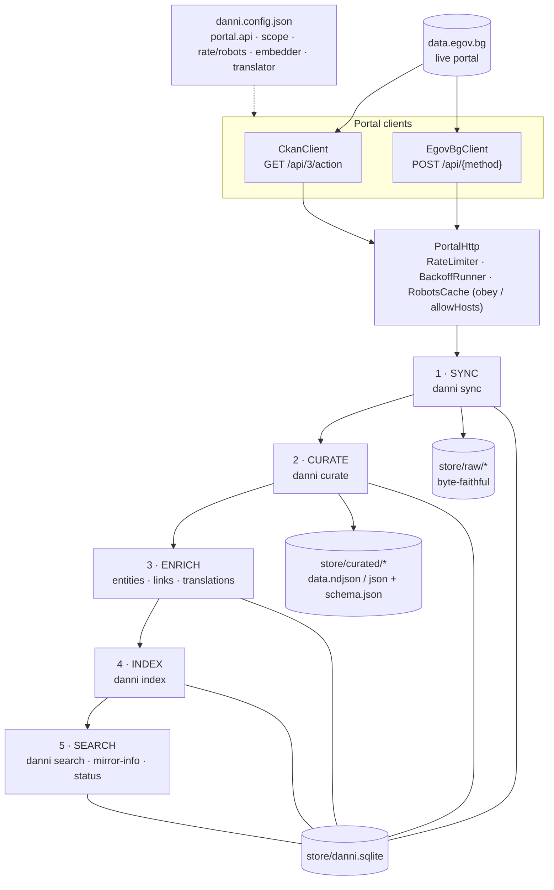
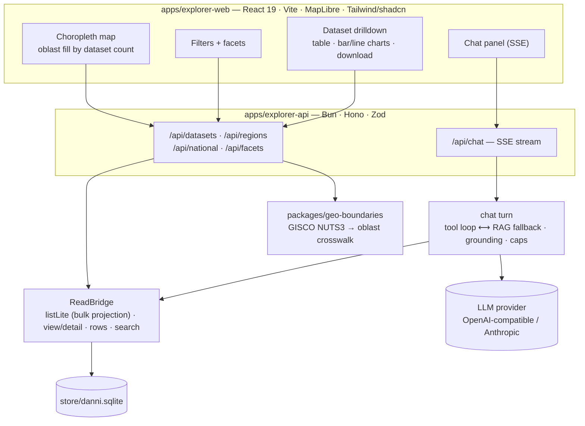

# danni-bg — Architecture

`danni-bg` keeps a **local, byte-faithful mirror of [data.egov.bg](https://data.egov.bg)** and turns it into a curated, enriched, machine-readable corpus that can be searched offline.

It is a Bun + TypeScript monorepo with two layers over one SQLite store:

```
build layer (CLI):   sync  →  curate  →  enrich  →  index  →  search      ← builds the store
serve layer:         MCP server  ·  HTTP API + web explorer (map + chat)   ← only reads the store
```

Each pipeline stage is independent, idempotent, and re-runnable; the store on disk is the source of
truth. The serving layer (§6) never writes — it projects the same store for LLM agents (MCP) and for
the interactive map explorer with a grounded chat assistant.

---

## 1. The pipeline at a glance



Plain-text view of the same flow:

```
                          danni.config.json
        portal.api (ckan│egov-bg) · scope · rate/robots · embedder · translator
                                   │
   ┌───────────────────────────────────────────────────────────────────────┐
   │                       data.egov.bg  (live portal)                       │
   └─────────────┬───────────────────────────────────┬─────────────────────┘
   CkanClient (GET /api/3/action)        EgovBgClient (POST /api/<method>)   │
   package_search / package_show          listDatasets / getDatasetDetails  │
                 └──────────────┬──────────listResources / getResourceData──┘
                                ▼
        PortalHttp  ─ RateLimiter · BackoffRunner · RobotsCache(obey / allowHosts opt-out)
                                │
   ╔════════════╗   ╔══════════▼═══════════╗   ╔═══════════╗   ╔═══════════╗   ╔══════════╗
   ║  1. SYNC   ║──▶║  2. CURATE           ║──▶║ 3. ENRICH ║──▶║ 4. INDEX  ║──▶║ 5.SEARCH ║
   ║ danni sync ║   ║   danni curate       ║   ║ (part of  ║   ║danni index║   ║danni     ║
   ╚═════╤══════╝   ╚══════════╤═══════════╝   ║  curate)  ║   ╚═════╤═════╝   ║ search   ║
         │                     │               ╚═════╤═════╝         │         ╚════╤═════╝
         ▼                     ▼                     ▼               ▼              ▼
   store/raw/*           store/curated/*        entities/links   datasets_fts   hybrid
   (byte-faithful)       data.ndjson|json       translations     dataset_       FTS5 + vector
                         + schema.json                           embeddings     (RRF fusion)
         └─────────────────────────┴─────── store/danni.sqlite ──────┴──────────────┘
```

---

## 2. Stages

### 1 · Sync — `danni sync` (`src/crawler`, `src/cli/sync.ts`)

Pulls the portal into `store/raw/` and records metadata in SQLite. Two interchangeable portal clients, selected by `portal.api`:

| `portal.api` | Client | Orchestrator | Notes |
|---|---|---|---|
| `ckan` (default) | `CkanClient` (GET `/api/3/action/*`) | `run-sync.ts` | Standard CKAN; documented contract + recorded fixtures |
| `egov-bg` | `EgovBgClient` (POST `/api/<method>`) | `run-egov-sync.ts` | data.egov.bg's **actual** API (governmentbg/data-gov-bg) |

All HTTP goes through `PortalHttp` (`http.ts`) with `RateLimiter`, `BackoffRunner`, and `RobotsCache`. Respectful by default; `crawler.robots.obey: false` / `allowHosts` is an operator opt-out for the official public API.

- **CKAN path**: `discover` (package_search) → `packageShow` → `capture-resource` downloads each resource's bytes (conditional GET via etag/last-modified).
- **egov-bg path**: `listDatasets` → `getDatasetDetails` → `listResources` → `getResourceData` (the portal's datastore returns rows; array-of-arrays → CSV, else JSON), captured into `store/raw/`.
- **Resumable full crawl** (`crawl-checkpoint.ts`, `scope-hash.ts`, `egov-validator.ts`): a `crawl_checkpoint` keyed by scope-hash with a **frozen sorted dataset-id cursor** and per-resource completion + attempt counts; **atomic capture** (temp + fsync + rename); runs inside `beginSyncRun` (shared `sync_runs_lock`, mutually exclusive with the CKAN path); `--max` per-session batch and `--retry-failed` (max-attempts cap).

**Writes:** `store/raw/<dataset>/<resource>/raw.*` + `datasets`, `resources`, `organizations`, `sync_runs` rows.

### 2 · Curate — `danni curate` (`src/curate`)

Normalizes raw bytes into typed, UTF-8 artifacts with a declared schema.

```
CuratorRegistry.select(resource)  ── sniff(magic bytes + extension + declared format)
        │
        ├─ CsvCurator   ├─ XlsxCurator   ├─ GeoJsonCurator   ├─ JsonCurator
        ├─ XmlCurator   ├─ TextCurator   └─ UncuratedMarker (fallback, raw retained)
        │                  └ dependency-free OOXML reader (ZIP central dir + node:zlib inflate)
        ▼
  encoding.ts  (BOM → CP1251 vs UTF-8 heuristic)
  normalize.ts (ISO/Bulgarian-month dates, decimal-comma numbers)
  schema.ts    (per-column type inference; canonicalizeName w/ Cyrillic→Latin transliteration)
```

`CsvCurator.canHandle` rejects ZIP-magic bytes so a mislabeled `.xlsx` routes to `XlsxCurator`. Column names are transliterated (`"Пореден №"` → `poreden_no`) while the original Cyrillic is preserved in `sourceName`/`labelBg`.

**Writes:** `store/curated/<dataset>/<resource>/data.ndjson|data.json|data.xml|data.txt` + `schema.json`, and a `curated_artifacts` row. Re-curation is idempotent per `curator_version`.

### 3 · Enrich — runs inside the curate orchestrator (`src/enrich`)

Attaches machine-meaning to each dataset.

```
Extractors (src/enrich/extractors)         registerEntities → entities + dataset_entities
  ckan_organization · ckan_groups · ckan_tags
  bg_admin_gazetteer (28 oblasts + municipalities)   linkDatasets → dataset_links
  iso8601_dates · bg_month_dates · column_name_heuristics   (shared entity, undirected)

Translators (src/enrich/translators)       translate → translations
  local-marianmt (stub) │ hosted-api        BG preserved byte-exact; EN added with provenance/confidence
```

`linkDatasets` is pairwise per shared entity (O(n²)), so generic "stop-word" entities (the tags
`регистър`/`община`, a whole oblast, a ministry publisher) would form huge cliques — one tag on 4k
datasets alone is ~8M links. A **fan-out cap** (`MAX_ENTITY_FANOUT`, default 50) skips any entity
shared by more than 50 datasets, so only specific/rare shared entities link; this keeps the link set
a meaningful "these two datasets are related" signal (~260k links) instead of a ~20M near-clique.

### 4 · Index — `danni index` (`src/index`)

Builds the two search indexes over active, curated datasets.

```
per dataset:
  buildFtsRow (fts.ts)            → datasets_fts          (FTS5 keyword)
  composeEmbeddingText (vec.ts)   → Embedder.embed()      → dataset_embeddings (BLOB vector)
                                     local-onnx (hash stub) │ hosted-api (real model)
```

Two recent additions make a corpus-scale re-index practical:

- **Incremental** (`index-state.ts`): a per-dataset `index_state(content_fp, embed_fp, model_id)` fingerprint ledger. A dataset is skipped only when its fingerprint matches **and** the target store row exists; a model change re-embeds **vectors only** (FTS is model-independent); `--full` forces a single-transaction rebuild; every run reconciles against `listActive()` and purges orphans from all three stores. Incremental is the default (`config.index.incremental`; precedence `--full` > config > true).
- **Batched** (`batch-embed.ts`): embeds **only the changed set** in batches (default 32) with positional length-checked mapping, single-text retry, and 429/5xx backoff; an `index_failures` ledger records per-dataset not-embedded reasons. FTS stays per-dataset, outside batching.

### 5 · Search & read (`src/index/query.ts`, `src/cli/{search,mirror-info,status}.ts`)

```
danni search "Плевен"   FTS5 keyword  ⊕  vector cosine  →  RRF fusion  →  ranked IndexEntry[]
searchByEntity(...)     entity-anchored recall via dataset_entities
danni mirror-info <id>  joins datasets+resources+curated_artifacts+entities+links+translations
danni status            sync-run history + freshness SLO
```

Every result carries a pointer back to the curated artifact and the original source URL (one-hop traceability).

---

## 3. Storage & schema

```
store/
 ├─ raw/      <dataset_id>/<resource_id>/raw.*        ← byte-faithful archive (a static mirror)
 ├─ curated/  <dataset_id>/<resource_id>/data.* + schema.json
 └─ danni.sqlite
```

Migrations are applied in numeric order by a checksum-guarded runner (`src/store/migrate.ts`):

| Migration | Adds | For |
|---|---|---|
| `001_core` | `datasets`, `resources`, `organizations`, `sync_runs` (+ lock + events) | sync |
| `002_curate_enrich` | `curated_artifacts`, `entities`, `dataset_entities`, `dataset_links`, `translations`, `embeddings_meta` | curate + enrich |
| `003_index` | `datasets_fts` (FTS5), `dataset_embeddings` (BLOB) | index |
| `004_index_failures` | `index_failures` | batch embedding |
| `005_index_state` | `index_state` (incremental fingerprints) | incremental indexing |
| `006_crawl_checkpoint` | `crawl_checkpoint` | resumable crawl |

Vectors are stored as plain BLOBs; similarity search is in-process cosine + Reciprocal-Rank-Fusion with FTS5 (the `sqlite-vec` virtual-table path is a future upgrade for large corpora).

---

## 4. Configuration (`danni.config.json`)

```jsonc
{
  "portal":  { "baseUrl": "...", "api": "ckan" | "egov-bg", "apiKeyEnv": null },
  "crawler": { "userAgent": "...", "rateLimit": {...}, "concurrency": {...},
               "backoff": {...}, "robots": { "recheckIntervalSeconds": 86400,
                                             "obey": true, "allowHosts": [] } },
  "store":   { "root": "./store", "freshnessSloSeconds": 86400 },
  "schedule":{ "enabled": false, "cron": null, "onOverlap": "skip", "notifier": {...} },
  "scope":   { "publishers": [], "categories": [], "tags": [], "datasetIds": [] },
  "enrichment": { "translator": { "provider": "local-marianmt" | "hosted-api", ... },
                  "embedder":   { "provider": "local-onnx"     | "hosted-api", ... } },
  "index":   { "incremental": true }
}
```

`scope` (empty = the whole portal) selects which datasets to mirror. `schedule` drives recurring runs with overlap prevention via the `sync_runs_lock`.

---

## 5. Source map (`src/`)

| Subsystem | Responsibility |
|---|---|
| `cli/` | the `danni` command surface (`sync`, `curate`, `index`, `search`, `mirror-info`, `status`, `schedule`) |
| `config/` | zod-validated config schema + loader |
| `crawler/` | portal clients (ckan/egov), `PortalHttp`, rate-limit/backoff/robots, discovery, capture, checkpoint/resume |
| `curate/` | curator registry + per-format curators, sniff/encoding/normalize/schema, curate orchestrator |
| `enrich/` | entity extractors, gazetteer, entity registrar, cross-dataset linker, translators |
| `index/` | FTS + vector builders, embedders, incremental `index_state`, `batch-embed`, query/search |
| `manifest/` | `beginSyncRun`, run records, lock, manifest writer |
| `store/` | `bun:sqlite` open/migrate + typed repos per table |
| `lib/`, `logging/`, `notify/`, `schedule/` | hashing/ids/time/fs, structured logging, notifier, cron |

---

## 6. The explorer & serving layer (`apps/`, `packages/geo-boundaries`)

The pipeline *builds* the store; the serving layer *only reads* it through one shared read substrate
(`src/read` + `src/index/query.ts`). Two front doors:

- **MCP server** — `danni mcp`, read-only tools for LLM agents (see [CONSUMERS.md](./CONSUMERS.md)).
- **Web explorer** — `apps/explorer-api` (Bun + Hono) + `apps/explorer-web` (React 19 + Vite +
  Tailwind/shadcn): an interactive Bulgaria choropleth with filters, dataset drilldown, and a
  grounded chat assistant.



**Read bridge — scaling to the whole catalog.** The whole-catalog endpoints (list / regions /
national / facets) project the store through `ReadBridge.listLite()`: four set-based SQL queries +
an in-memory join, instead of materializing a full `CuratedDatasetView` (≈7 queries) per dataset. At
the full ~12k-dataset mirror the per-dataset fan-out cost tens of GB of RAM and timed out; the bulk
projection answers in tens of milliseconds at ~140 MB. Detail / rows endpoints stay keyed by id.
`regions-aggregate.ts` buckets each dataset's `geo:` entities into per-oblast choropleth counts.

**Chat — grounded, provider-agnostic.** `/api/chat` streams Server-Sent Events. A turn runs a tool
loop over four **scope-filtered** tools — `mirrorSearch`, `mirrorEntitySearch`, `mirrorInfo`,
`readResource` — so the model can only retrieve in-scope datasets; every id a tool returns is
recorded and citations are validated against it (hallucinated/out-of-scope sources are dropped).
Providers without function-calling (a vanilla vLLM Gemma) fall back to a **RAG path** that retrieves
scoped candidates server-side and feeds them as context, so grounded chat works with any
OpenAI-compatible model. Context guards (`apps/explorer-api/src/chat/cap.ts`): `capDatasetDetail`
trims a high-degree dataset's links/entities and `capResourceContent` bounds a resource read, so a
large artifact can't overflow the model's window; `maxOutputTokens` reserves output room; the loop
runs up to 16 steps so a multi-dataset question (comparing periods/regions) can read one figure per
dataset before answering.

**Serving-layer source map**

| Path | Responsibility |
|---|---|
| `apps/explorer-api/` | Hono routes, `ReadBridge` (`listLite`/view/detail/rows/search), regions aggregation, scope filtering, chat (`chat/{run,tools,grounding,cap,scope,session,providers}.ts`), SSE |
| `apps/explorer-web/` | React SPA: MapLibre map, filters, dataset list/detail + chart/table drilldown, chat panel, Zustand store, pure `lib/*` (choropleth/pagination/table/chart/markdown/theme) |
| `packages/geo-boundaries/` | GISCO NUTS3 → 28-oblast crosswalk + geometry, joined by Cyrillic name |
| `src/read/`, `src/index/query.ts` | the shared read substrate both front doors consume |

---

## 7. Caveats worth knowing

- **The semantic half is opt-in.** `local-onnx` (embedder) and `local-marianmt` (translator) ship as **deterministic placeholders** — the FTS/keyword half of search is always real, but real *semantic* vectors and EN translations need a real model wired via `provider: "hosted-api"` (see [semantic-search.md](./semantic-search.md)). The reference deployment points the embedder at a vLLM **Qwen3-Embedding-8B** (4096-dim) on the LAN and the chat at an OpenAI-compatible model; `batch-embed` makes a real-model re-index practical at corpus scale.
- **The explorer needs `apps/explorer-api` running, and chat needs a provider.** The web app reads the same store live (no rebuild to see new sync/curate/index results — just refresh). Chat uses the server-default provider from `EXPLORER_DEFAULT_*` env, or a per-request user config; a provider without function-calling automatically uses the RAG fallback. To run unsandboxed for LAN access to the embedder/LLM, see the project memory + `specs/008-map-data-explorer/quickstart.md`.
- **The live data.egov.bg crawl needs the egov adapter + a robots opt-out.** The portal does **not** serve the CKAN API at `/api/3/action/` (every method returns "Непознат метод"); use `portal.api: "egov-bg"` with `baseUrl: "https://data.egov.bg/api/"`. The site's `robots.txt` is `Disallow: /`, so an authorized crawl of its public API requires `crawler.robots.obey: false` (or `allowHosts: ["data.egov.bg"]`). The egov datastore serves resources as JSON rows, captured as CSV → curated as tabular.
- **The store is the source of truth.** Any stage can be re-run; the raw archive remains usable read-only even if the portal is unreachable.

---

*See `specs/001-egov-data-sync/` for the foundational spec/plan; `specs/002-006-*/` for the
incremental-index, batch-embedding, crawl-resume, pipeline-hardening, and embedding-eval features;
`specs/007-read-api-mcp/` for the read API + MCP server; and `specs/008-map-data-explorer/` for the
map explorer + chat (each with its clarified spec, plan, contracts, and task list).*
